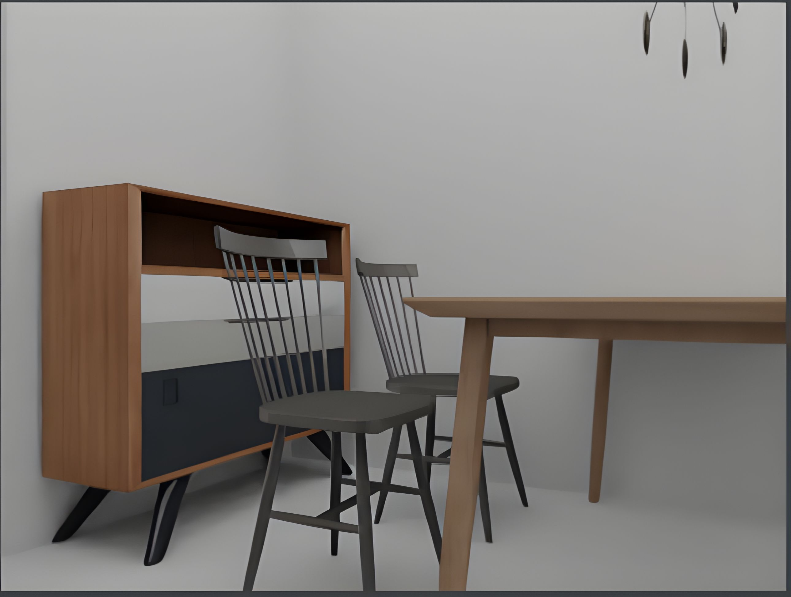
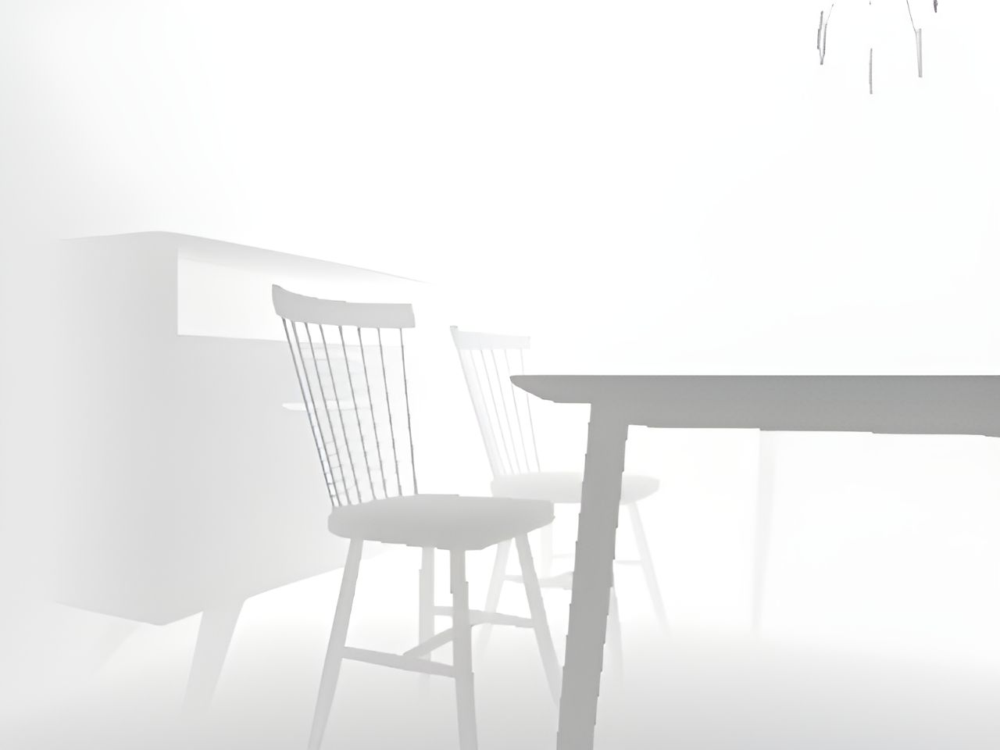
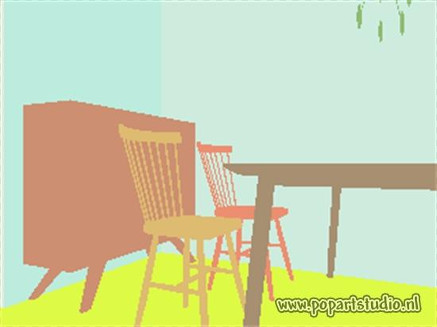

# Increasing Object-Level Reconstruction Quality in Single-Image 3D Scene Reconstruction

## Abstract
 Panoptic 3D Scene Reconstruction describes the joint task of geometric reconstruction, 3D semantic segmentation, and 3D instance
segmentation. A multitude of tasks in Robotics, Augmented Reality and Human-Computer Interaction rely on this comprehensive understanding of 3d scenes. Building upon the method introduced by Dahnert et al. [3], which performs panoptic 3D scene reconstruction from a single RGB image, our proposal aims to enhance the visual clarity and discernibility of the generated geometry through a Retrieval-inspired approach.  Leveraging a 3D asset generation framework [4] , we conduct object-level reconstruction conditioned on semantic labels and image input, further advancing the capabilities of panoptic 3D scene reconstruction.


## Environment
The code was tested with the following configuration:
- Ubuntu 20.04
- Python 3.8
- Pytorch 1.7.1
- CUDA 10.2
- Minkowski Engine 0.5.1, fork
- Mask RCNN Benchmark

## Installation
```
# Basic conda enviromnent: Creates new conda environment `panoptic`
conda env create --file environment.yaml
conda activate panoptic
```

### MaskRCNN Benchmark
Follow the official instructions to install the [maskrcnn-benchmark repo](https://github.com/facebookresearch/maskrcnn-benchmark).

### Minkowski Engine (fork, custom)
Follow the instructions to compile [this forked Minkowski Engine version](https://github.com/xheon/MinkowskiEngine) from source.

### Compute library
Finally, compile this library. 

```
# Install library
cd lib/csrc/
python setup.py install
```

## Inference
TODO


## Datasets

### 3D-FRONT [1]

The [3D-FRONT](https://tianchi.aliyun.com/specials/promotion/alibaba-3d-scene-dataset) indoor datasets consists of 6,813 furnished apartments.  
We use Blender-Proc [2] to render photo-realistic images from individual rooms.
We use version from 2020-06-14 of the data.

<p align="center">
    
    
    
</p>


#### Download:
We generate a new synthetic 3D-Front dataset comprising over 24,000 samples, each annotated with both 2D and 3D ground truth data.
As subsample of the data can be found here: [link](https://drive.google.com/file/d/1P_GLihTcxCPBHk1T25IYN50OvQBp3ANt/view?usp=sharing)

## Models:

We jointly train the 2D encoder, depth estimation and 2D instance prediction of the panoptic reconstruction model. The model checkpoint can be found [here](resources/trained2d-ours.zip)

We fine-tune SDFusion [4] on the 3D-Future dataset [5]. The fine-tuned model can be found [here](https://drive.google.com/file/d/1BLG3sJwKfgB2VOIS1VRGI4Ij6W3DrOYE/view?usp=drive_link)

# References

1. Fu et al. - 3d-Front: 3d Furnished Rooms with Layouts and Semantics
2. Denninger et al. - BlenderProc
3. Dahnert et al. - Panoptic 3d scene reconstruction from a single rgb image
4. Cheng et al. - Sdfusion: Multimodal 3d shape completion, reconstruction, and generation.
5. Fu et al. - 3d-future: 3d furniture shape with texture.


